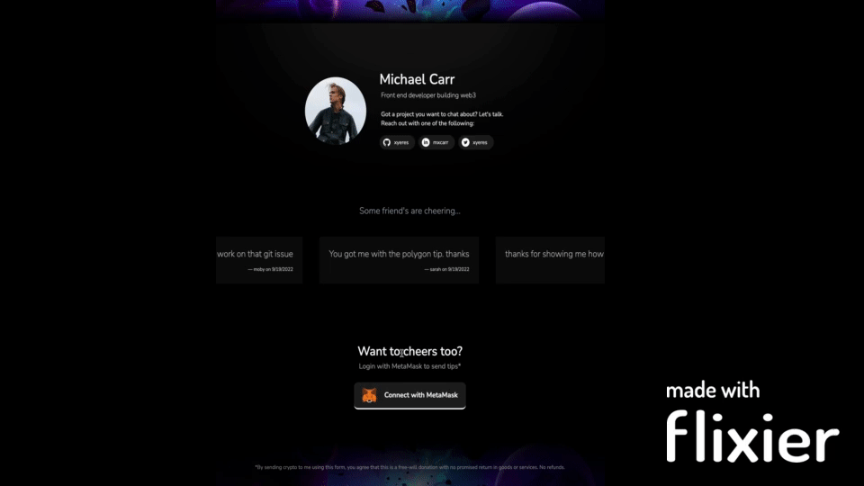

# Tip A Developer
### A web3 dApp that allows users to tip their favorite developer friends with crypto!

[View live site here](https://tipadeveloper-xyeres.vercel.app/)

[](https://tipadeveloper-xyeres.vercel.app/)

### Smart Contract
Built on Polygon, the smart contract allows user interactions (through wallets such as MetaMask) like tipping, withdrawal of tips, and transfer of contract ownership.

The solidity contract is comprised of 3 primary functions: 

- `tip()` - allows a transaction to be sent along with a user name, message and value amount
- `withdrawTips()` - transfer's contract balance to contract owner, a public method callable by anyone
- `transferOwner()` - allows contract owner to transfer ownership of contract to another address

#### Example of Solidity functions:

```java
    /**
     * @dev Sends tip to contract owner
     * @param _name name of the tip sender
     * @param _message a nice message from the tip sender
     */

    function tip(string memory _name, string memory _message) public payable {
        require(msg.value > 0, "Tip must be greater than 0");

        // add memo to storage
        memos.push(Memo(msg.sender, block.timestamp, _name, _message));
        // Emit a log event when a new memo is created
        emit NewMemo(msg.sender, block.timestamp, _name, _message);
    }
```

#### Testing
Testing is imperative while writing Smart Contracts and I have made test coverage a top priority. Testing is made possible using `Chai` and `Mocha` and `hardhat` with chai matchers for Ether specific matchers.

For example, a most important function, `transferOwner` must operate properly or else loss of funds could take place!

#### Example test coverage for high-value functions:

```javascript
describe("Protected", function testProtected() {
    describe("Ownership", function testOwnership() {
      it("Should revert with correct error when called by non-owner", async function revertWhenNotOwner() {
        const { tipADeveloper, owner, tipper3 } = await loadFixture(
          deployTipADevFixture
        );
        await expect(
          tipADeveloper.connect(tipper3).transferOwner(tipper3.address)
        ).to.be.revertedWith(
          "You must be owner of contract to transfer ownership"
        );
        expect(await tipADeveloper.owner()).to.equal(owner.address)
        expect(await tipADeveloper.owner()).to.not.equal(tipper3.address)
      });

      it("Should transfer ownership to new owner and shouldn't revert", async function shouldTransferOwner() {
        const { tipADeveloper, owner, newOwner } = await loadFixture(
          deployTipADevFixture
        );

        // Check initial expected state
        expect(await tipADeveloper.owner()).to.equal(owner.address);

        // Call SUT correctly
        await expect(
          tipADeveloper.connect(owner).transferOwner(newOwner.address)
        ).to.not.be.reverted;

        expect(await tipADeveloper.owner()).to.equal(newOwner.address);
      });
    });
  });
```

### The Client
The client is built using `Nextjs`, custom `React` hooks and `ethers.js`.

#### Client features of note:
- The memo marquee data is drawn directly from the blockchain
- When a new memo is added, the solidity contract fires a `NewMemo` event and this triggers a refresh in the client so the user see's their contribution immediately
- If MetaMask is *not* installed, the client will see a nicely rendered grayscale button informing them to get MetaMask or learn more about it

### Challenges
One of the greatest challenges with web3 is perhaps adoption. Creating apps that do not *require* a user to have certain knowlege or experience (i.e. MetaMask installed and ready to go) is imperative. If we want to create accessible apps then we must generally lower the barrior of engagement to gain adoption. Perhaps many of our web3 apps do not need to be *fully* decentralized in favor of creating more well known user experiences. 
### Future development
This could be the basis of an online creative community powered by the generosity of fans and supporters who give to their favorite developer's to encourage continued project development. The site could be setup as an on-demand service that allows any developer to create a profile, deploy their own smart contract and then share their site URL with supporters. 